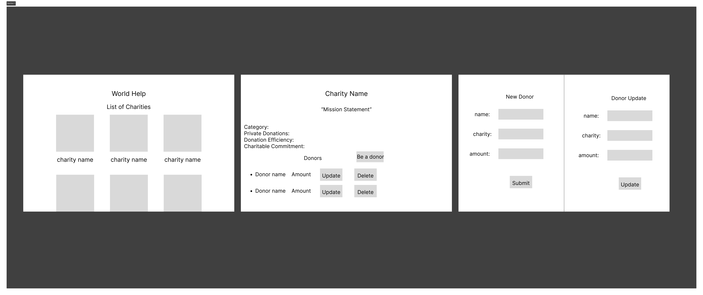

# World-help

World Help is an application for connecting donors to reputable charities. Users can browse through charities and contribute to their favorites by creating a Donor profile and making a donation pledge.

## List of features 

- Look through logos and names of charities 
- Button to update donors/ donations 
- Button to delete donors/ donations
- create  donors/ donations
- View details of each charity
- View total donations of charities 

## How to use

Welcome to World-help, listed below is a template on how to use our website:

Home Page:
Entering our website you should see a list of charity organizations. You can select an organization by clicking on the organizations logo to donate/pledge too. This will lead you to the charity page.

Charity Page:
The charity page first displays, the name of the organization, the category, the total revenue, the fundraising effieceny, charitable commitment and a the organizations mission statement. The charity page will show donors names and donations/pledges. This page will have a donation/pledge button which will lead you Donor page. Next to the name and donation/plegde there will be an update button and a delete button, where the donor can unfornately delete their pledge. The update button will lead to the donor page where they can edit their pledge name and amount.

Donor Page:
The donor page will have form where the donor can input their name, their pledge amount and an update button which will lead back to the charity page where it will show their donation/pledge. 

## CRUD Functionality

This app we will have full CRUD functionally which includes 
- Creating donor profiles 
- Updating donor amounts 
- Deleting donor details
- Donors can browse cause category, fundraising efficiency, and charitable commitment
- Ability to search through all charities

## Planned features 

- Sign-in, signup page 
- Password authentication 
- Post function: donors can make posts on page for public to see

## Acknowledgements

Forbes.com for database information.